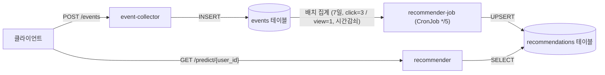

# event-driven-recommendation-app

유저 행동 기반 추천 시스템 — **애플리케이션 서비스 레포** (FastAPI · MLOps 포트폴리오)

이벤트 수집 → 배치 스코어링 → 추천 서빙으로 이어지는 MLOps 파이프라인을 **DevOps 관점에 중점을 두고** 구성한 포트폴리오 프로젝트입니다.
이 레포는 **앱 코드 + CI**(이미지 빌드/푸시)를 담당하며, 배포(인프라·GitOps)는 [event-driven-recommendation-infra](https://github.com/Zuzzang2/event-driven-recommendation-infra) 레포가 맡는 **2-repo GitOps 패턴**입니다.

## 아키텍처 — 도메인 데이터 흐름



배치(CronJob)가 미리 점수를 계산해 두므로, 서빙(`/predict`)은 무거운 집계 없이 단순 SELECT로 빠르게 응답합니다.

## 서비스 구조

```
apps/
├── event-collector/   # FastAPI — POST /events → events 테이블 적재
├── recommender/       # FastAPI — GET /predict/{user_id} → recommendations 조회
└── recommender-job/   # Python 배치 — K8s CronJob(*/5), 점수 계산 후 UPSERT
migrations/            # Alembic 마이그레이션 (events, recommendations)
.github/workflows/     # CI (build-push 재사용 + 서비스별 caller)
```

## 기술 스택

| 영역 | 기술 |
|------|------|
| API | FastAPI (Python, asyncpg) |
| DB | Supabase (외부 관리형 PostgreSQL, Session Pooler) |
| 마이그레이션 | Alembic + psycopg2 |
| 컨테이너 | Docker (linux/arm64, python:3.11-slim) |
| Registry | ghcr.io |
| CI | GitHub Actions (docker buildx, 네이티브 arm64) |

## DB 스키마 (Supabase)

```sql
CREATE TABLE events (
    id         SERIAL PRIMARY KEY,
    user_id    VARCHAR(50) NOT NULL,
    item_id    VARCHAR(50) NOT NULL,
    event_type VARCHAR(20) NOT NULL,  -- 'view' | 'click'
    created_at TIMESTAMP   DEFAULT NOW()
);

CREATE TABLE recommendations (
    user_id     VARCHAR(50) NOT NULL,
    item_id     VARCHAR(50) NOT NULL,
    score       FLOAT       NOT NULL,
    computed_at TIMESTAMP   DEFAULT NOW(),
    PRIMARY KEY (user_id, item_id)
);
```

### 추천 점수 알고리즘
click 가중치 **3**, view 가중치 **1**, 시간 감쇠, **7일 윈도우**. 복잡한 ML 없이 SQL UPSERT로 처리.

```
score = SUM(가중치) / ((now - 최근행동) 시간 / 3600 + 1)
```

## API

| 메서드 | 경로 | 설명 |
|--------|------|------|
| POST | `/events` | 행동 이벤트 수집 (`{user_id, item_id, event_type}`) |
| GET | `/predict/{user_id}` | 점수순 추천 목록 반환 |
| GET | `/health` | 헬스 체크 |
| GET | `/metrics` | Prometheus 메트릭 |

## 로컬 실행

```bash
# 1) DB 마이그레이션 (최초 1회)
cd migrations && pip install -r requirements.txt
export DATABASE_URL='postgresql://<user>:<pw>@<host>:5432/postgres'
alembic upgrade head

# 2) API 서비스 (예: event-collector)
cd apps/event-collector && pip install -r requirements.txt
export DATABASE_URL='postgresql://...'
uvicorn app.main:app --host 0.0.0.0 --port 8000

# 3) 배치 스코어링 (recommender-job)
cd apps/recommender-job && pip install -r requirements.txt
DATABASE_URL='postgresql://...' python job.py
```

> DB 연결은 `DATABASE_URL` 환경변수 단일 진입점으로 통일. 시크릿은 절대 커밋하지 않습니다.

## CI (GitHub Actions)

`main` 브랜치에 `apps/<service>/**` 가 변경되면 해당 서비스만 빌드/푸시합니다.

```
git push main (apps/** 변경)
  → ci-<service>.yaml (paths 필터)
    → build-push.yaml (재사용 워크플로우, runs-on: ubuntu-24.04-arm)
      → docker buildx --platform linux/arm64
      → ghcr.io/zuzzang2/<service> 푸시 ( :sha-<short> · :latest )
```

- 재사용 워크플로우 1개(`build-push.yaml`) + 서비스별 thin caller 3개로 중복 제거
- ghcr 패키지는 **public** (k3s가 pull secret 없이 받음)
- **CD(배포)는 자동화하지 않음** — infra 레포에서 이미지 태그를 매니페스트에 고정하고 **ArgoCD 수동 Sync**

## Prometheus 메트릭

| 메트릭 | 타입 | 서비스 |
|--------|------|--------|
| `event_collect_requests_total` | Counter | event-collector |
| `predict_requests_total` | Counter | recommender |
| `predict_latency_seconds` | Histogram | recommender |
| `recommender_job_duration_seconds` | Gauge | recommender-job |

## 배포

이 레포는 이미지까지만 만듭니다. 실제 K8s 배포는 인프라 레포가 담당합니다:
- **[event-driven-recommendation-infra](https://github.com/Zuzzang2/event-driven-recommendation-infra)** — Terraform(AWS·k3s) + Kustomize 매니페스트 + ArgoCD(GitOps)
